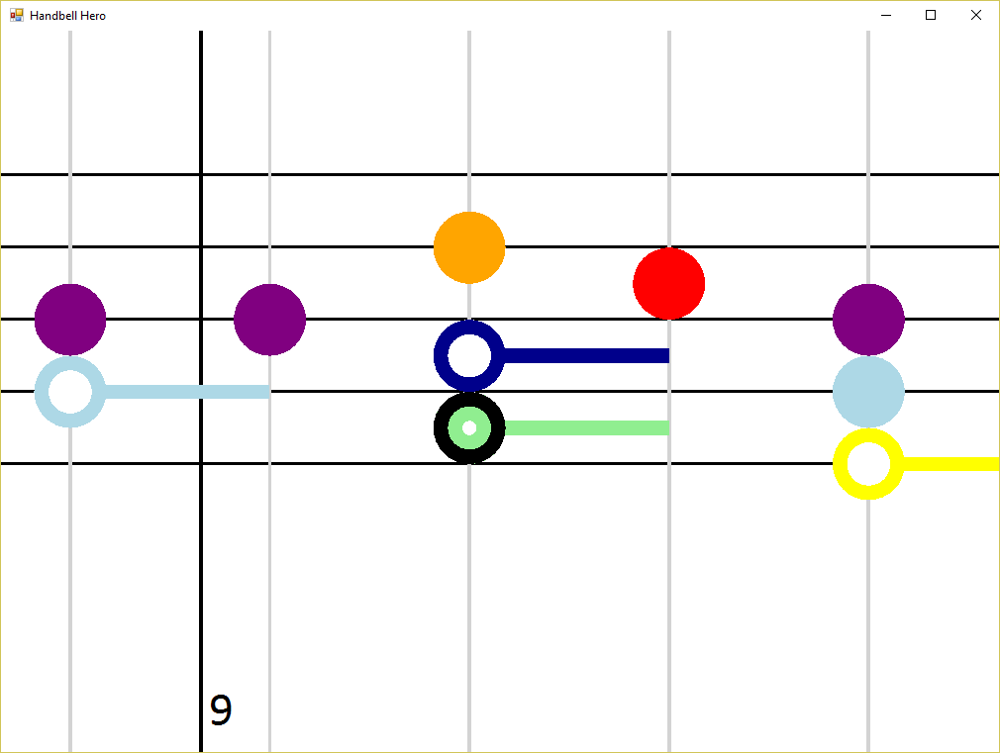

# Handbell Hero



## Installation

Download and run Setup.exe from the [latest release of Handbell Hero](https://github.com/dsplaisted/HandbellHero/releases/latest).

## Controls

- **N** - Toggle between summary view (which displays a graph of how often each note is used in the piece of music) and music view (which displays the notes to play)
- **O** - Open file.  After a music file has been opened, you will need to restart the program if you want to go back to the list of built-in music pieces
- **Up / Down** - In summary view, move to the previous or next music piece, either in the list of built-in pieces or in the folder from which the music piece was opened
- **Left / Right** - In music view, move backward or forward in the piece
- **Space** - Play or pause the music
- **S** - Turn sound on or off
- **R** - Reset the current position to before the beginning of the piece of music
- **F5** - Reload the current piece of music from file.  This is helpful when authoring music to quickly see the changes you've made
- **G** - Go to position in the piece of music (a dialog will display where you can type in a position to go to)
- **Plus / Minus** - Transpose the piece of music up or down
- **, / .** - Increase / decrease music speed (beats per minute)

## Authoring music

Notes are written using the letters `A` through `G`.  `C` represents Middle C.  Lowercase letters indicate a note one octave higher than the uppercase letter.  Any number of minus (`-`) or plus (`+`) characters can be added after the note.  Each one raises or lowers the note by one octave.  So `C+` is the same as `c`.  The C scale starting at middle C is: `C D E F G A B c`.  A sharp is indicated by the pound sign (`#`), which goes before any `+` or `-`.  There's no notation for flat notes, so express them as sharps instead: ie for D flat, use `C#`.  [KidsPlay Handbells](http://www.grothmusic.com/p-3074-kidsplay-25-note-colored-handbell-set-2-octaves.aspx) are available in 2 octaves from G3 (`G-`) to G5 (`g`).

Notes separated by spaces indicate notes that are played one after the other.  Notes without spaces between them are played together.  For example, `C E G` represents three subsequent notes, while `CEG` represents the same notes played together as a chord.

By default, all notes are quarter notes.  A number after a note or group of notes can be used to modify the note length.  The number indicates the length of the note in terms of 1/32 notes.  So `C16` is a half note, `C8` or just `C` is a quarter note, `C4` is an eighth note, `C6` is a dotted eighth note, and so on.

Putting it all together, here's what "Mary had a little lamb" would look like:

```
' Mary had a little lamb
E D C D E E E16
' Little lamb, little lamb
D D D16 E E E16
' Mary had a little lamb, its
E D C D E E E E
' fleece was white as snow
D D E D C32
```

This example uses comments to include the words of the song.  A comment starts with the apostrophe (`'`) character, and goes until the end of the line.  Comments are ignored by the software and can be used to include notes for yourself or others.

Rests are written using the dash (`-`) character.  Like notes, the default rest length is a quarter note, but it can be modified by a number after it.  So `-16` is a half note length rest.

To represent different lengths of notes being played at the same time, you will need to use the backslash (`\`).  By itself, the backslash moves the current position back to the beginning of the previous note.  So `C \ E` is the same as `CE`.  `C16 \ E F` is two quarter notes E and F played at the same time as a half note C.  A backslash can also be immediately followed by a number, and this will move the current position the amount specified in that number.  A positive number will move the current position forward, while a negative number will move it backwards.  So `\-32` moves the current position back by one measure.

There are several "commands" available.  These commands start with an exclamation point (`!`) followed by the command name, and after that until the end of the line is the information that the command uses.  The following commands are available:

- **!Title** - Sets the title of the piece of music that will be displayed in Summary view.
- **!BeatsPerMinute** or just **!bpm** - The beats per minute for the piece of music.  The default is 80.
- **!LookAhead** - The length of music to display after the current position in the song.  The default is 48, or 1 and a half 4 / 4 measures.  For faster or slower music, you may want to adjust this.
- **!LookBehind** - The length of previously played music to display before the current position in the song.  The default is 8, or a quarter note.
- **!Transpose** - Transpose the music up or down by the specified number of semitones.  `!Transpose -12` moves everything down by an octave.  This command can be used multiple times, and sets the transposition from where it occurs until it is modified again by another transpose command.

## Sample songs

You can find some sample songs [here](songs).